# 조경호 포트폴리오

------

> 조경호(KyungHo Jo) 

----

## 자기소개 / INTRO

say something

------

## Projects

----

1. 교내 스토리텔링 기반 가상현실 콘텐츠 제작 경진대회 (공모전) - 기획 / 발표 
   – 악플에 대한 VR게임 제작 2019년 (교내 대상 / 우수상 )

2. 벤처아카데미 포디랜드 미니 인턴 팀장 – 기획 / 총괄 PM 
   
   
   
   
   
   
   
   

3. SW 콘텐츠 분야 벤처 – 스타트업 아카데미 해커톤 ‘강’팀 팀장 및 총괄 / 발표 (장려상) 
   
   
   
   
   
   
   

4. IMSCC(국제수리과학창대회) / 포디프레임학회 캡스톤 부문 은상 (PM/팀장) - 인턴할 때 만들었던 앱을 디벨롭하여 발표 
   

5. OOTD (AI 사용자 기반 옷 추천 서비스) - 백엔드 / AI학습 / 기획

   
   
   
   
   
   

6. 프로젝트 '여운' - 도서 추천 웹사이트 (최우수) - 백엔드 / 서버 배포
   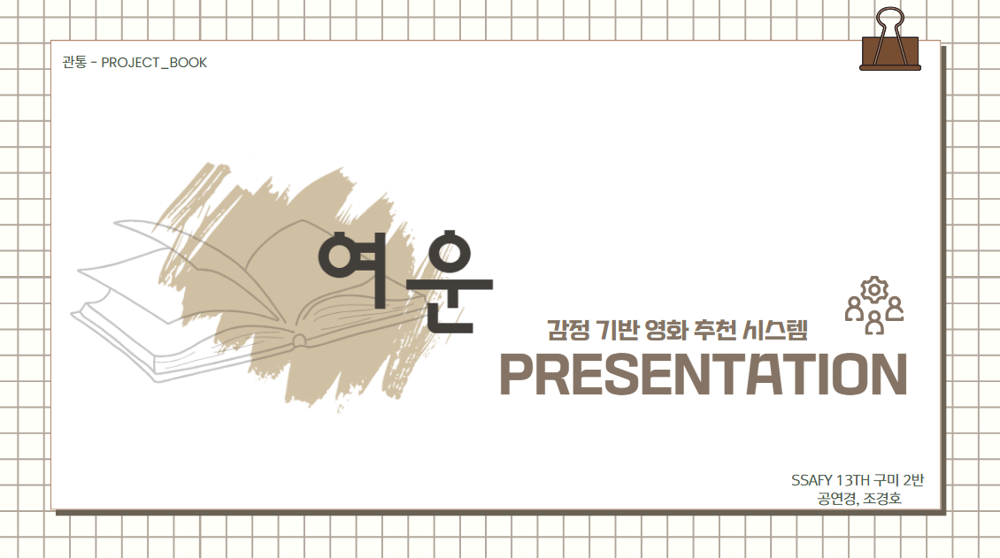
   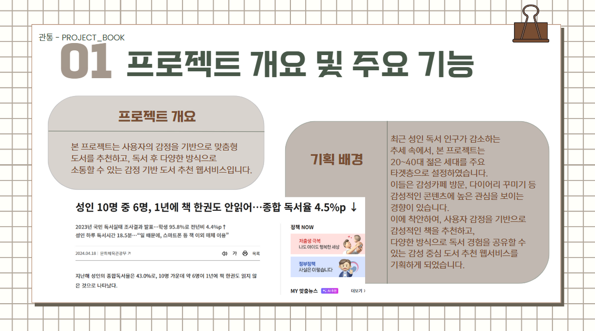
   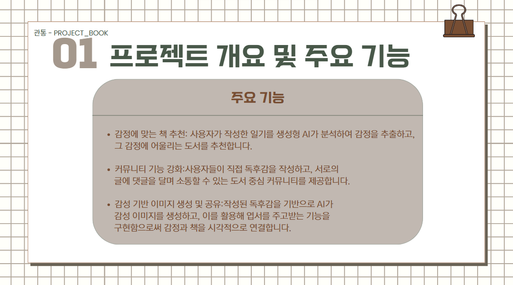
   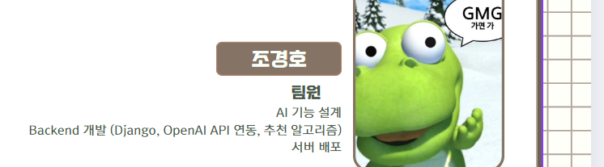
   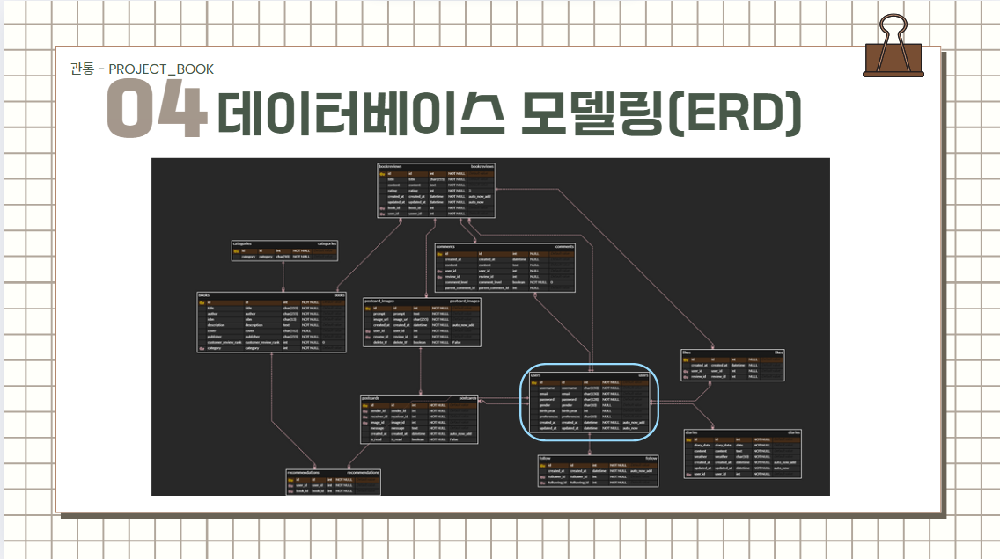
   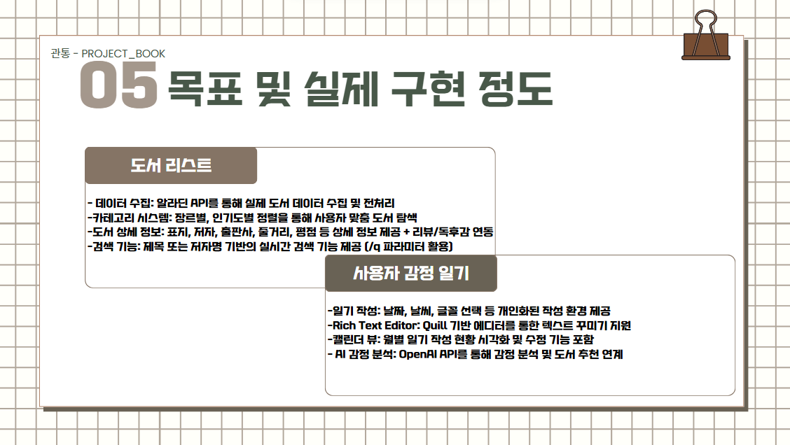
   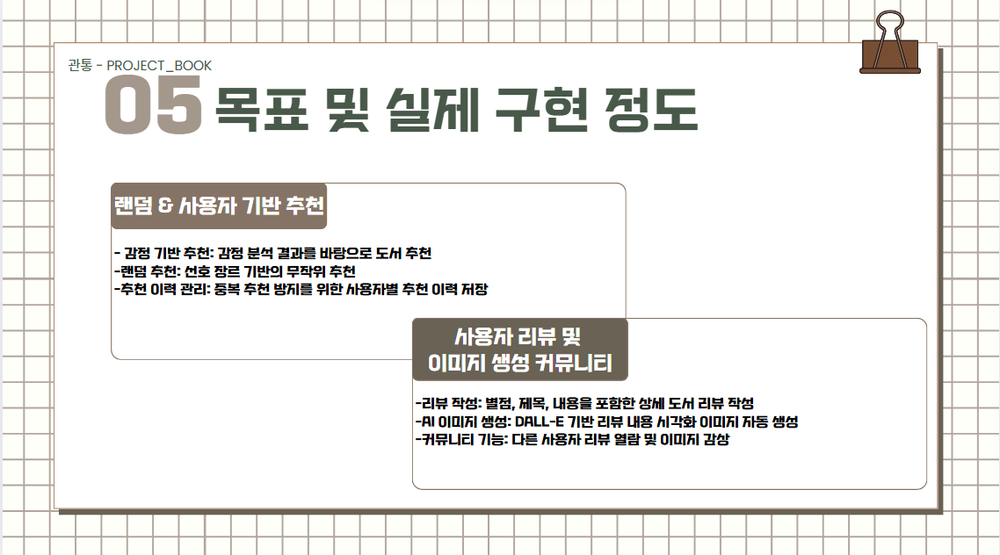
   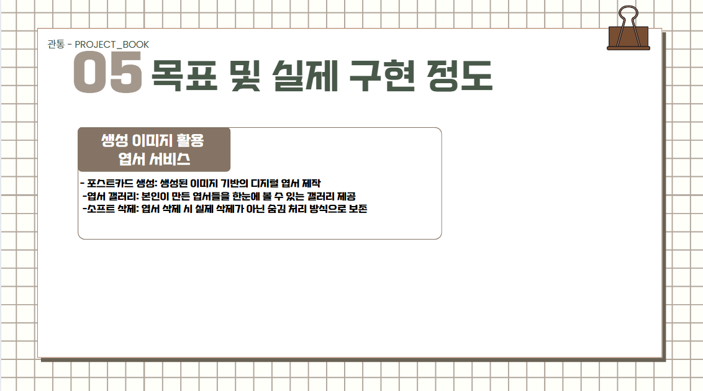
   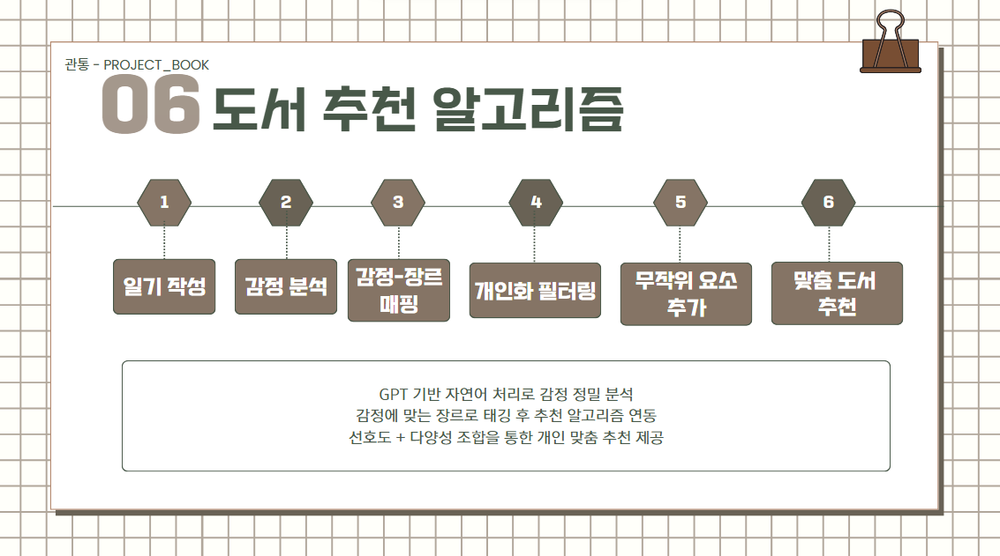
   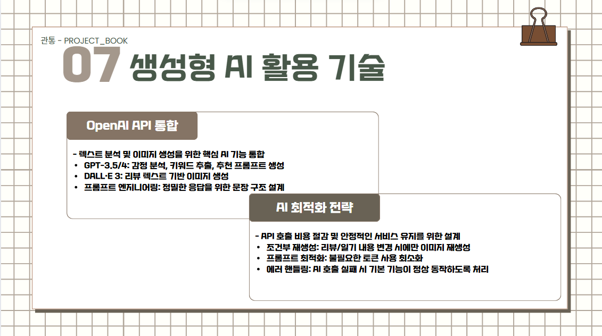
   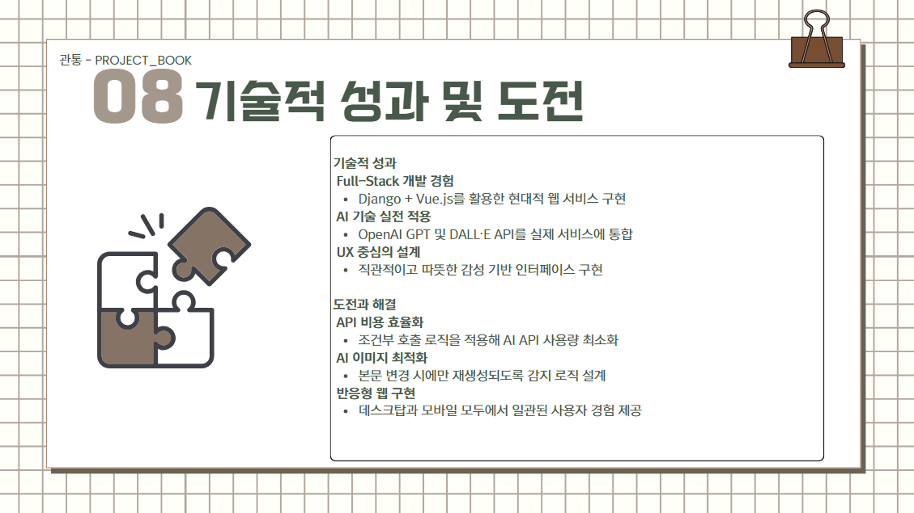
   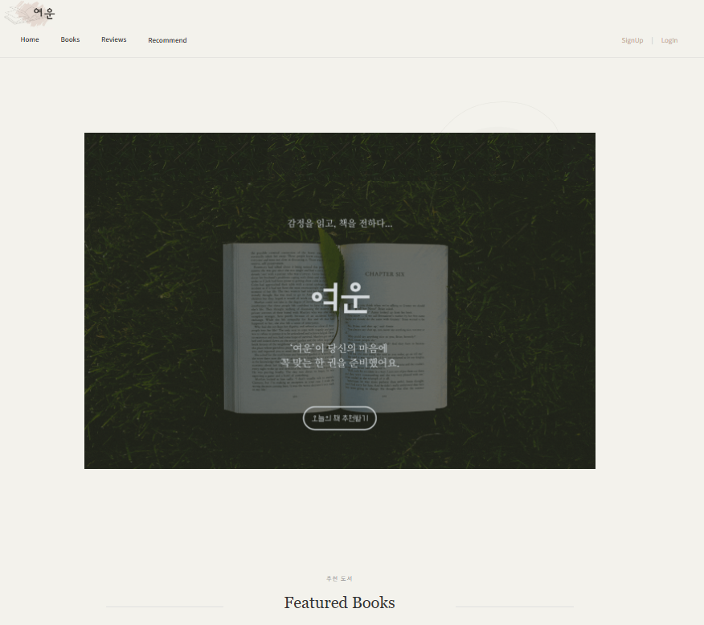
   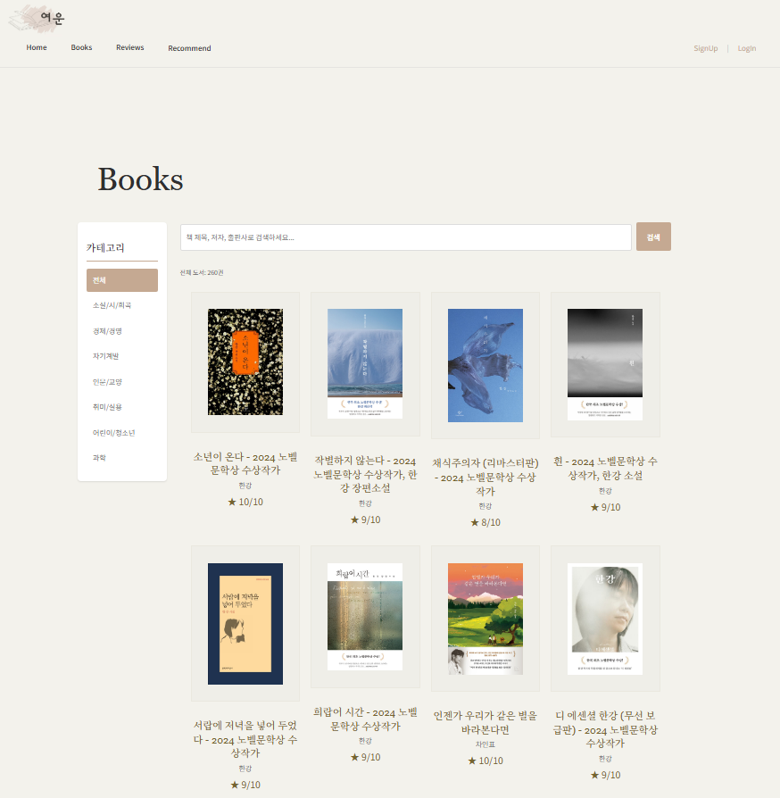
   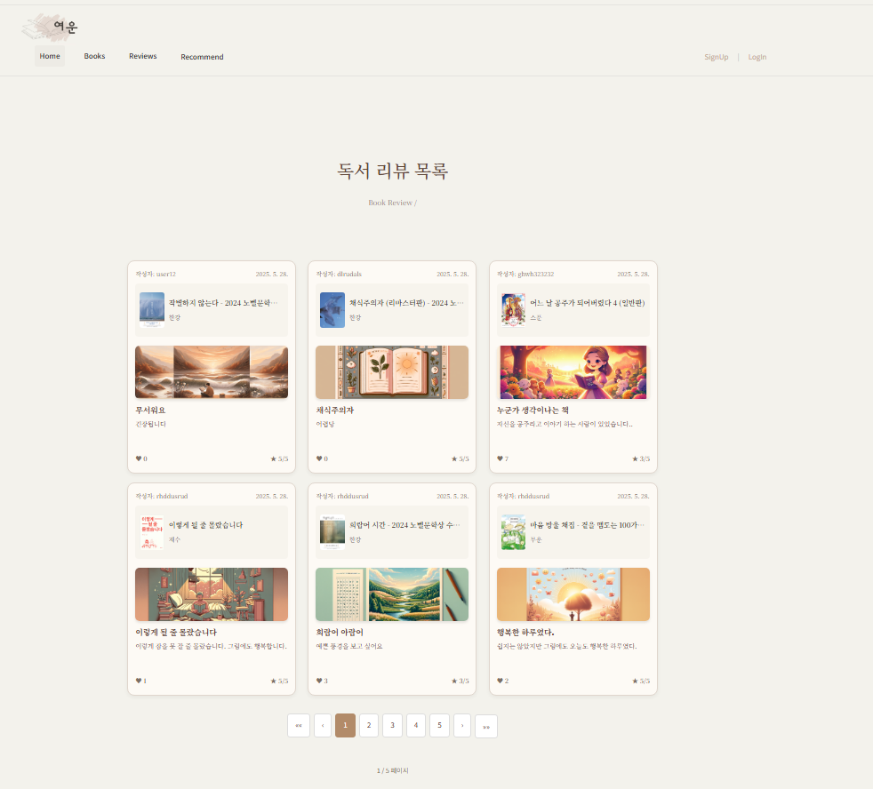
   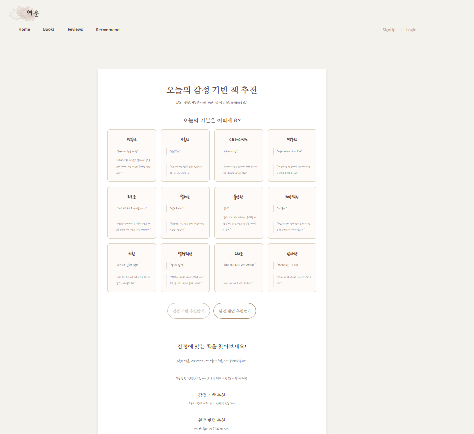
   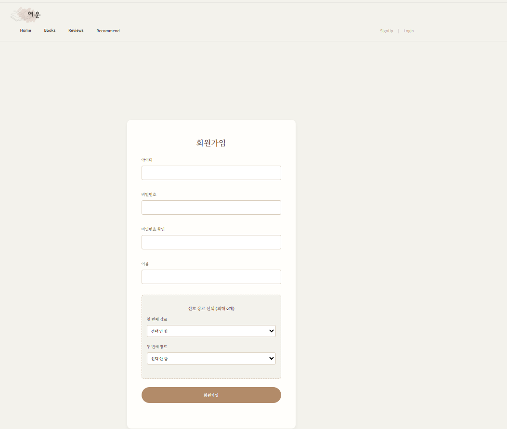
   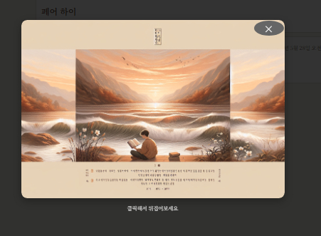
   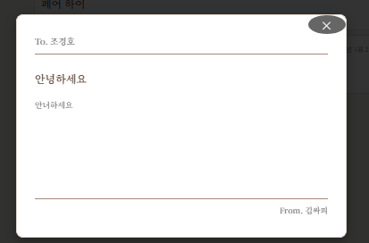
   ---

# PetPlace
### 우리동네 펫 커뮤니티 

---

# 프로젝트 개요
{width=800 height=430}
{width=800 height=430}
{width=800 height=430}
{width=800 height=430}
{width=800 height=430}
{width=800 height=430}
{width=800 height=430}
{width=800 height=430}
{width=800 height=430}
{width=800 height=430}
{width=800 height=430}
{width=800 height=430}

# 스플래쉬 화면
{height=430}

# 피드 페이지
- TopHeader의 부드러운 숨김처리 구현
- 피드 5개씩 페이지네이션 구현
- 글 작성 화면 구현 
- 개인 추천 알고리즘 적용  
- 좋아요, 댓글 FCM 알람 연동 

{height=430}
{height=430}
{width=200}

# 우리동네 페이지
- 바텀시트 구현
- 카카오맵 API 연동하여 위치 마커 표시

{height=430}

# 산책/돌봄 페이지
- 게시판 리스트 구현 
- 글 작성 화면 구현

{height=430}
{height=430}

# 실종 신고/등록 페이지 
- 실종신고 페이지 구현(잃어버렸어요)
- 실종등록 페이지 구현(목격했어요)
- 실종매칭 FCM 알람 연동 

{height=430}
{height=430}
{height=430}

# 채팅페이지
{height=430}

# 마이페이지
- 꼬순내 로직 구현
- 마이 프로필 수정 
- 내 가족(펫) 등록 및 추가 
- 신뢰기반 내 용품 등록 구현
- 마이피드, 댓글, 찜한피드 조회 구현

{height=430}
{height=430}

# 영상포트폴리오
[{width=800 height=430}](https://www.youtube.com/watch?v=vrb4LYhehxQ)

# 시스템 아키텍처

# ERD

# 상세 역할분담

- 조경호: AI 모델 연구 및 최적화, 빅데이터 추천 로직 구현, 인프라 구축, 채팅 기능 구현

## 기타

1. 2019 교내 지피지기 팀장 

2. 교내 국제학생단 프렌즈(외국인 멘토링 프로그램) - 2019

3. 교내 마음나눔센터 서포터즈 1,2기 부팀장 – 영상 편집 / 기획 / 촬영 / 스토리 제작 / 카드 뉴스 제작 - 2021

4. 한국장학재단 멘토링 – 팀장 (5년 째 만남 가지는 중) - 2021

5. 2024 중소벤처기업부 2024 벤처 스타트업 아카데미 수료 - 최종 한국여성벤처협회장 수상  
